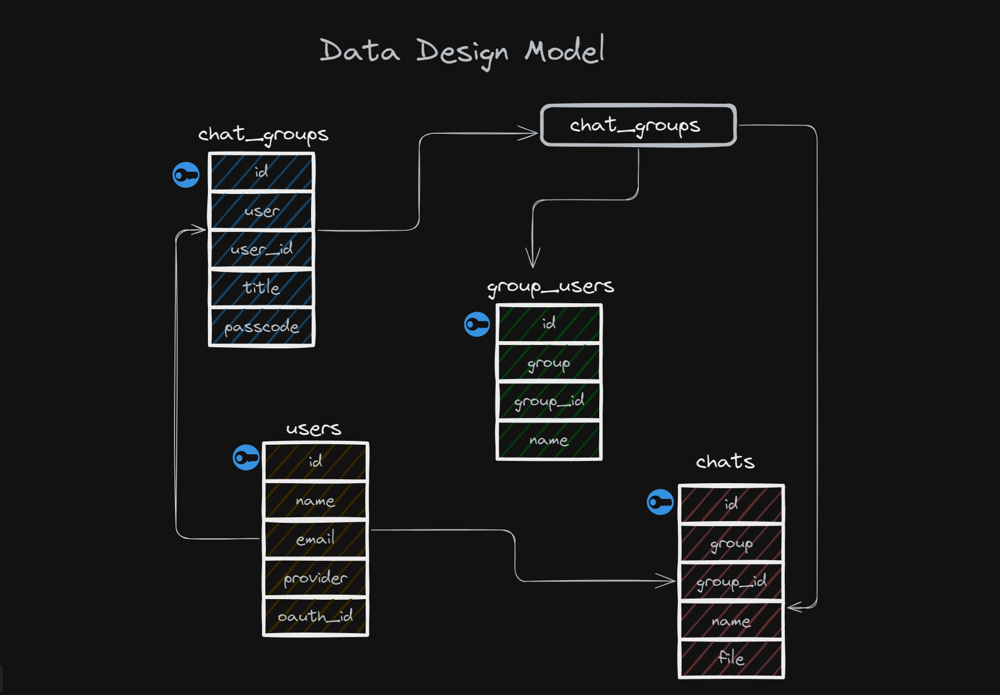
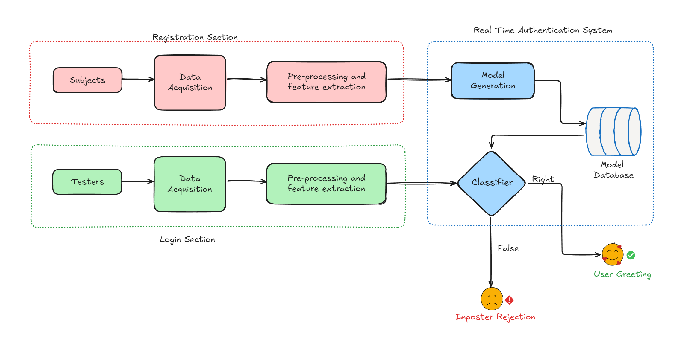
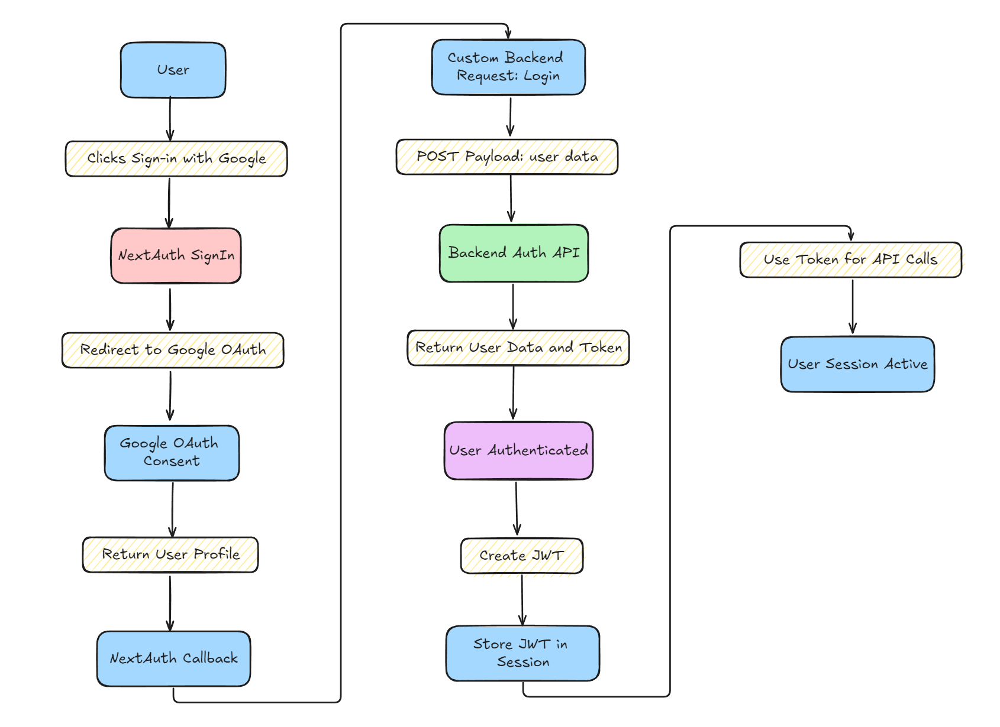
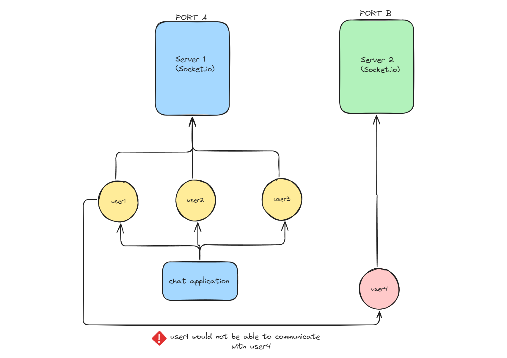
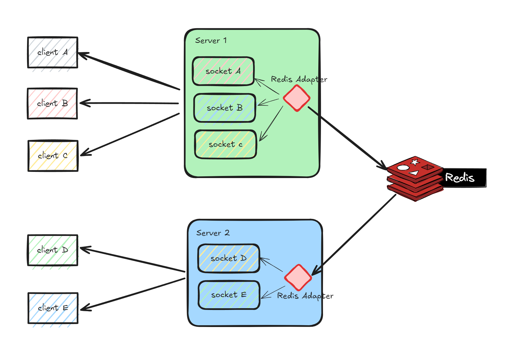
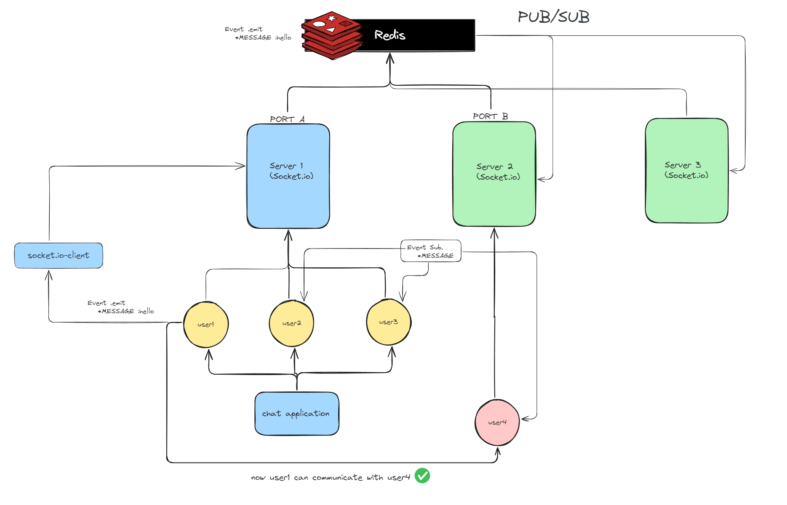
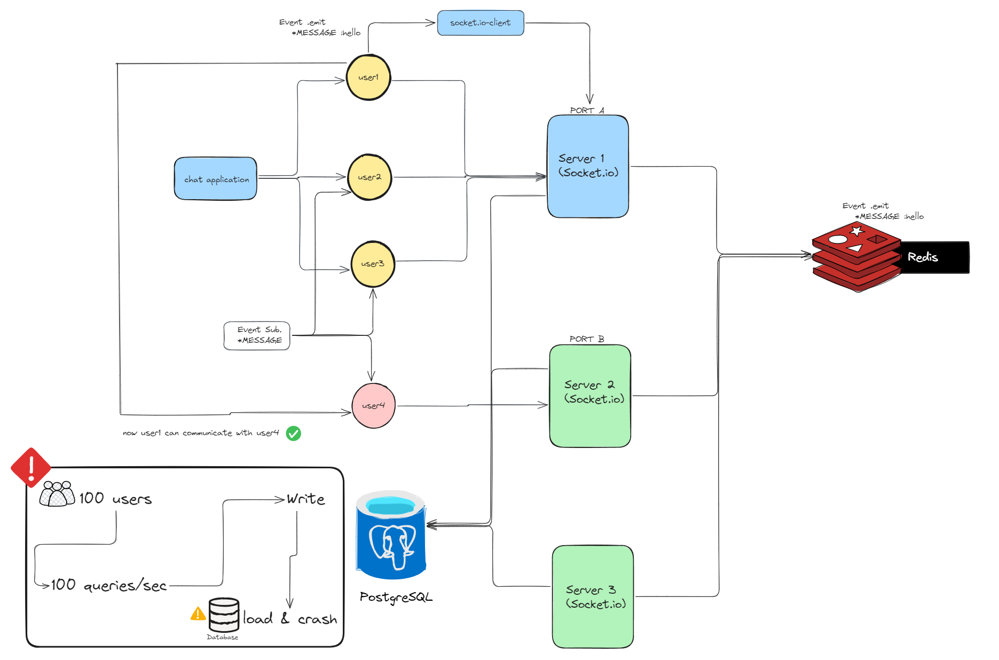
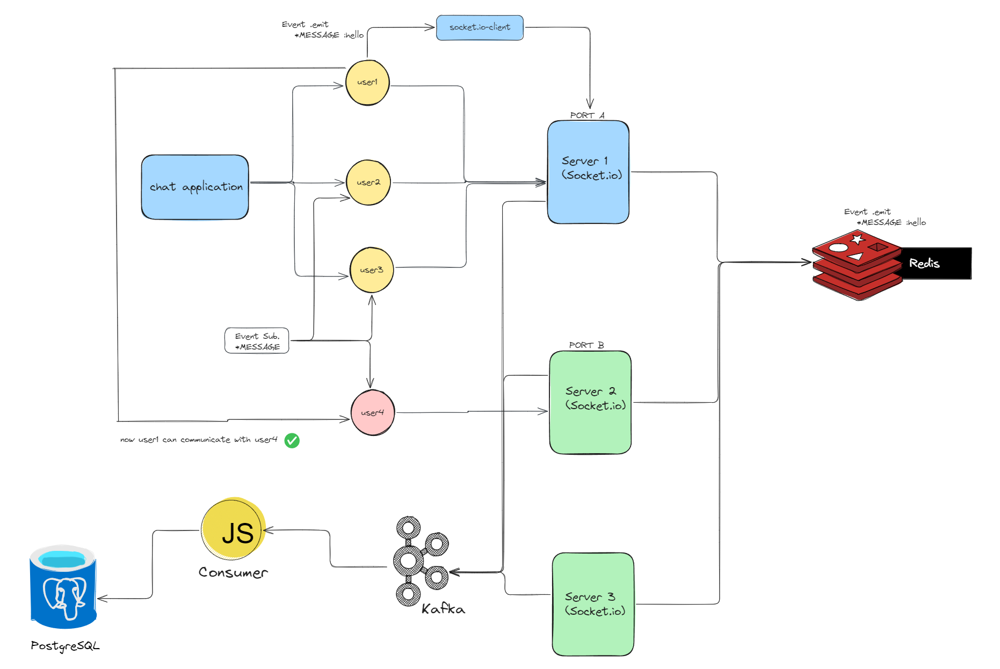

# System Design of ChatApp

This document outlines the system design for a scalable, real-time chat application.

## What is a Chat Application

A chat application is a software platform that enables users to send and receive instant messages in real-time. These applications allow users to communicate with one another via text, voice, or video, providing a seamless and instantaneous way to connect, whether one-on-one or in groups.

## Requirements

Our system should meet the following requirements:

#### Functional Requirements :

1. Server should receive data.
2. Should support one-on-one chat.
3. Group chats.
4. Should support file sharing.

#### Non Functional Requirements :

1. Ensure reliability and high availability
2. Minimize delays for quick response times.
3. Enable efficient scalability to support growing users and data.

#### Extended requirements :

1. Sent, Delivered, and Read receipts of the messages.
2. Show the last seen time of users.
3. Push notifications.

## Estimation and Constraints

#### Traffic :

- **Daily Active Users (DAU):** 10 million
- **Messages per User:** 15
- **Total Messages:** 150 million per day
  - **Media Files:** 10% of messages are media (~15 million media files/day)

> **Explanation:** We assume 10 million users, each sending 15 messages per day. About 10% of those messages include media like images, videos, or files.

#### Requests Per Second (RPS) :

- **RPS:** 150 million messages/day ≈ 1,736 requests per second

> **Explanation:** Dividing 150 million messages by 86,400 seconds (1 day) gives us ~1.7K requests per second.

#### Storage :

- **Text Messages:** 14 GB/day (average 100 bytes per message)
- **Media Files:** 750 GB/day (50 KB per file)
- **Total Storage (10 years):** ~2.8 PB

> **Explanation:** For text messages, 100 bytes per message means 14 GB of daily storage for 150 million messages. Media files at 50 KB each would require 750 GB per day. Over 10 years, the total estimated storage requirement is ~2.8 PB.

#### Bandwidth :

- **Required Bandwidth:** 90 MB/s (for 764 GB/day)

> **Explanation:** To handle 764 GB of total data (14 GB for text + 750 GB for media), we need around 90 MB per second.

#### High-level Summary :

| Type                 | Estimate     |
| :------------------- | :----------- |
| `DAU`                | `10 million` |
| `RPS`                | `1,736/s`    |
| `Storage (daily)`    | `~764 GB`    |
| `Storage (10 years)` | `~2.8 PB`    |
| `Bandwidth`          | `~90 MB/s`   |

## Data Model Design



This document outlines the database schema and data model for a chat application. The system consists of several core entities that manage users, chat groups, and messages exchanged within those groups.

#### Tables Overview :

#### 1. **Users Table**

This table stores basic user information required to identify and manage individual users within the system.

| Column       | Data Type | Description                                      |
| ------------ | --------- | ------------------------------------------------ |
| `id`         | Int       | Unique identifier for each user (auto-increment) |
| `name`       | String    | The name of the user                             |
| `email`      | String    | The unique email address of the user             |
| `provider`   | String    | Authentication provider (e.g., Google, Facebook) |
| `oauth_id`   | String    | ID from the authentication provider              |
| `image`      | String?   | URL of the user's profile image (optional)       |
| `created_at` | DateTime  | The date and time when the user was created      |

#### 2. **Chat Groups Table**

This table manages the chat groups, allowing users to participate in conversations with multiple members.

| Column       | Data Type | Description                                            |
| ------------ | --------- | ------------------------------------------------------ |
| `id`         | String    | Unique identifier for each chat group (UUID)           |
| `user_id`    | Int       | Foreign key referencing the user who created the group |
| `title`      | String    | The title of the chat group                            |
| `passcode`   | String    | Optional passcode for group access                     |
| `created_at` | DateTime  | The date and time when the group was created           |

#### 3. **Group Users Table**

This table links users to chat groups, indicating which users are members of which groups.

| Column       | Data Type | Description                                                        |
| ------------ | --------- | ------------------------------------------------------------------ |
| `id`         | Int       | Unique identifier for the group-user relationship (auto-increment) |
| `group_id`   | String    | Foreign key referencing the chat group (UUID)                      |
| `name`       | String    | Name of the user in the group                                      |
| `created_at` | DateTime  | The date and time when the user joined the group                   |

#### 4. **Chats Table**

This table stores the chat messages exchanged within each group.

| Column       | Data Type | Description                                        |
| ------------ | --------- | -------------------------------------------------- |
| `id`         | String    | Unique identifier for each chat message (UUID)     |
| `group_id`   | String    | Foreign key referencing the chat group (UUID)      |
| `message`    | String?   | The content of the chat message (optional)         |
| `name`       | String    | Name of the user who sent the message              |
| `file`       | String?   | URL of any file shared in the chat (if applicable) |
| `created_at` | DateTime  | The date and time when the message was sent        |

#### Relationships

- **Users and Chat Groups**: A user can create multiple chat groups, and each group can have multiple users.
- **Chat Groups and Group Users**: Each chat group can have multiple users linked to it.
- **Chat Groups and Chats**: A chat group can contain many chat messages, each sent by different users.

#### Conclusion

This data model provides a comprehensive structure for managing users, chat groups, and messages in a chat application. By utilizing relational database principles, it ensures that the system can efficiently handle user interactions and maintain data integrity. Feel free to modify the descriptions or details to better fit your application's specific requirements!

##  Authentication Flow



#### Login Flow

1. **Sign-in Request**: A user initiates the login process by signing in using Google OAuth.
2. **Google Authentication**: The OAuth process retrieves the user's profile (name, email, and image) and a provider account ID.
3. **Custom Backend Login**: Once the user's Google data is obtained, a request is sent to the custom backend (`LOGIN_URL`) with the user’s information. The backend checks if the user exists or creates a new user if necessary.
4. **Session Token Creation**: The backend returns a JWT token and user data, which is then attached to the session object.
5. **Token Handling**: The token is stored for further authentication in subsequent API requests.

#### Token-based Authentication

After a successful sign-in, the token provided by the backend is stored within the user session. This token is then used for authentication during subsequent operations that require user verification.

## API Design

*POST /api/auth/signin*:
- Purpose: Start the OAuth login process using Google as the provider.

- Flow:

    - User clicks on the "Sign in with Google" button.
    - NextAuth redirects to Google’s OAuth consent page.
    - Google returns the user profile information.
    - The API sends a POST request to the custom backend to authenticate the user and retrieve a token.



- *Payload to Backend*:
```json
{
  "email": "user@example.com",
  "name": "User Name",
  "oauth_id": "123456789",
  "provider": "google",
  "image": "user_image_url"
}
```
- Response from Backend:
```json
{
  "user": {
    "id": "1",
    "token": "jwt_token",
    "provider": "google"
  }
}
```
- NextAuth Integration:

    - The backend response is used to update the user object, storing the user ID and token in the session.

*Callbacks in NextAuth*

- **signIn()**:

    - Verifies the user after receiving data from Google OAuth.
    - Sends user data to the backend for authentication and retrieves the token and user ID.
    - If successful, the session is established.

- **jwt()**:

    - Updates the JWT token with the user information after login.
    - This token is passed in subsequent API calls for verifying the user.

- **session()**:

    - Ensures that the token is available in every session and can be accessed when needed during user operations.

#### Security Considerations
- *JWT Expiration*: The token received from the backend includes an expiration (set to 365 days in this case). This ensures that the user’s session remains active for a long period unless manually logged out.
- *Google OAuth Scopes*: The Google OAuth scope includes `openid`, `email`, and `profile` to retrieve minimal information needed for authentication without exposing excessive data.

#### Error Handling
- Invalid Login:

    - If an error occurs during the sign-in process or backend authentication, an appropriate error message is returned.
    - In the signIn() callback, returning false prevents the login attempt and renders an error message on the client side.

- Session Expiry:

    - If the JWT token expires or is invalidated, the user will be logged out, and the session will be terminated.

#### **Scalability and Future Enhancements**
- **Additional Providers**: While this setup uses Google OAuth, other providers like GitHub, Facebook, or custom OAuth providers can be added to NextAuth easily.
- **Multi-factor Authentication (MFA)**: MFA can be introduced in future iterations to add an extra layer of security.

## Design

### Cross-Server Communication Issues

This document outlines the design considerations for a simple chat application that allows users to communicate in real-time using Socket.IO. The application aims to provide a seamless chat experience across different users connected to the same server. However, challenges arise when users are connected to different servers or ports, which limits their ability to communicate with each other.



#### **Problem Statement** :

> When a user connects to a specific server or port (e.g., User-4 on Port B), they are unable to communicate with users connected to another server or port (e.g., Users on Port A). This isolation can hinder the overall chat experience, especially in scenarios where users need to interact with others across different servers.

#### Example Scenario

- Server Setup:
  - Port A: Hosts users User-1, User-2, and User-3.
  - Port B: Hosts User-4.
- Communication Issue:
  - User-1 on Port A sends a message to User-4 on Port B.
  - Due to the architecture, User-1 cannot reach User-4, leading to a fragmented communication experience.

---
### Solving Cross-Server Communication Issues with Redis Pub/Sub

#### **Problem Statement** :

> In a chat application, users connected to different servers or ports cannot communicate with each other directly. For instance, if User-1 sends a message while connected to Server 1, User-4, who is connected to Server 2, will not receive that message due to the inherent isolation between the two servers. This lack of interoperability can lead to fragmented user experiences and limit the application's functionality, preventing a seamless communication flow among all users.


#### **Proposed Solution: Redis Pub/Sub** :

##### Redis :
> Redis is a fast, in-memory database that helps store and manage data quickly. It's often used for real-time applications, like chat apps, because it can send messages between users instantly. Redis uses a simple system called Pub/Sub, where messages are published to channels and everyone subscribed to those channels can receive them immediately. This makes it great for handling lots of messages without delays.



To address the issue of cross-server communication, we can implement a messaging architecture using Redis Pub/Sub. This solution enables real-time message broadcasting and allows users connected to different servers to communicate effortlessly.



#### How It Works :
1. User Sends a Message 
    - When User-1 wishes to send a message, they emit an event using Socket.IO:

    ```javascript
    socket.emit("MESSAGE", "hello");
    ```

2. Publishing to Redis:
    - The message is then published to a designated Redis channel, such as `Event.MESSAGES` :

    ```javascript
    redisClient.publish("Event.MESSAGES", JSON.stringify({ userId: User-1.id, message: "hello" }));
    ```

3. Subscription by Other Users:
    - All users connected to various servers subscribe to the same Redis channel:

    ```javascript
    redisClient.subscribe("Event.MESSAGES");
    ```

4. Message Broadcasting:
    - When a message is published, Redis broadcasts it to all clients that are subscribed to the channel. Each subscribed client listens for new messages:
    ```javascript
    redisClient.on("message", (channel, message) => {
        const { userId, message } = JSON.parse(message);
        displayMessage(userId, message);
    });
    ```

5. Message Handling:
    - Upon receiving a message, each client can update its UI to display the new message, ensuring that all users are kept in sync.

#### Benefits of Using Redis :
- Real-Time Communication: Redis Pub/Sub enables instantaneous message delivery, enhancing the overall chat experience by minimizing latency.
- Decoupling: The architecture effectively decouples the message producers (users) from the message consumers (other users), allowing for flexible scaling without tight coupling.
- Performance: Redis operates primarily in memory, which allows for extremely low-latency message handling, even under heavy loads.

---
### Scaling the Application with Kafka

#### **Problem Statement** :

>As the user base of the chat application grows, the volume of messages can become overwhelming. For instance, if the application has 100 users and each user sends one message per second, this translates to 100 messages per second. Directly storing this influx of messages in PostgreSQL can lead to performance bottlenecks, potential database crashes, and a poor user experience.



#### **Proposed Solution: Apache Kafka** :

To effectively manage high message throughput and ensure scalable message processing, we can introduce Apache Kafka as an intermediary message broker. Kafka is designed to handle high-volume data streams efficiently and acts as a buffer between message producers and consumers.



#### How It Works :
1. User Sends a Message:
    - When a user sends a message, it is published to a Kafka topic instead of directly to the database:

    ```javascript
    kafkaProducer.send({
        topic: 'chat-messages',
        messages: [{ value: JSON.stringify({ userId: User-1.id, message: "hello" }) }]
    });
    ```

2. Kafka Topic:
    - The messages are organized in a Kafka topic (e.g., chat-messages), which can efficiently handle the incoming stream of messages due to Kafka's partitioning and replication capabilities.

3. Consumers:
    - A dedicated consumer service continuously reads messages from the Kafka topic. This consumer is responsible for processing the messages and ensuring they are correctly formatted for database storage.

    - The consumer can be implemented as a separate microservice that reads from the Kafka topic:

    ```javascript
    kafkaConsumer.run({
        eachMessage: async ({ topic, partition, message }) => {
            const { userId, message } = JSON.parse(message.value);
            await saveToDatabase(userId, message);
        }
    });
    ```

4. Data Storage:
    - After processing, the consumer writes the messages to PostgreSQL for persistent storage:

    ```javascript
    async function saveToDatabase(userId, message) {
        await db.query('INSERT INTO messages (user_id, content) VALUES ($1, $2)', [userId, message]);
    }
    ```

#### Benefits of Using Kafka :

-   High Throughput: Kafka is designed to handle a massive volume of messages efficiently, making it well-suited for applications with high message rates.
- Durability: Messages published to Kafka are stored for a configurable retention period, allowing for recovery in case of consumer failure or crashes.
- Scalability: Kafka can be scaled horizontally by adding more brokers and partitions, allowing the system to accommodate increased loads seamlessly. This capability ensures that even during peak usage, message delivery remains reliable.

#### Conclusion :
By leveraging Redis Pub/Sub for real-time cross-server communication and implementing Apache Kafka for scalable message processing, we can construct a robust chat application that efficiently handles high message volumes while ensuring seamless interactions among users. This architectural design addresses both immediate communication needs and future scalability challenges, setting the foundation for an adaptable and responsive chat application.